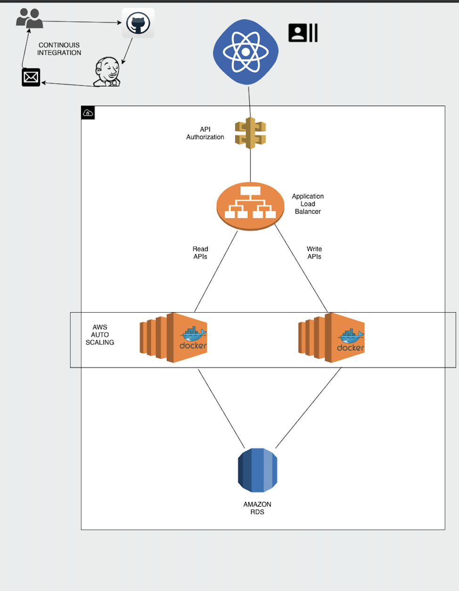
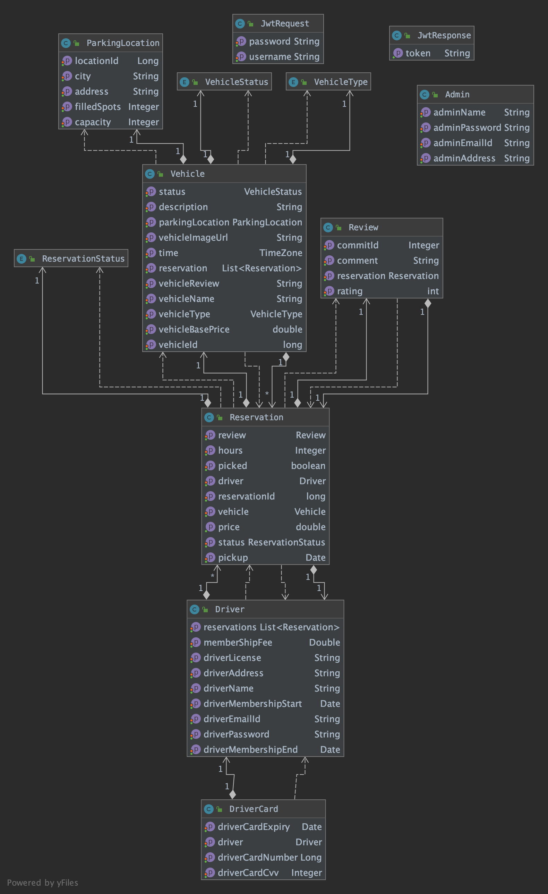

#  Car Hire Application for Anybody with a Driver's License
 
## Sprint Task Sheet
https://docs.google.com/spreadsheets/d/1bwUoeZ0_PFh3q6xMzNdLJCtQJ6lX0SsjbzNv-Miogr0/edit?usp=sharing

## Project journal
Documentation/ProjectJournal.md

# Team

1. Sai Chaitanya Dasari
2. Krutika Katelia
3. Sathya Sri
4. Yashwant Khade

## Design Doc
https://docs.google.com/document/d/1DM46SGXyhCMIH70hC72ufU-x_5uT-EtUg1gDs10Lwmk/edit

## Technology Stack
FrontEnd : React
Backend : Java Springboot with Hibernate 
Testing: Postman
Cloud : AWS 

## Abstract

We have developed a Spring MVC based web application to create a eco system where the users can book a car for a short trip/Weekend trip by registering into our application. We leveraged the java design patterns to develop a string backend that is deployed as an auto-scaled and load-balanced application on AWS. Frontend integration in ReactJS completes the end-to-end integration.

## Cloud Architecture

 ## UML DIAGRAM

## Backend Services
We will be using SRPING MVC Java APIs to fetch the values from the Models. Since our application will render information on run-time, the non-blocking asynchronous nature of JAVA will help us get good performance.

## Data Layer
The data will be stored and accessed from a AWS RDS database. SqlDb provides ACID properties structure which will assist in storing and querying structured data and handeling isolated transactions. 

## Client Side
Frontend is built on ReactJS as it is a light-weight library built over JavaScript, which doesn't re-render the entire DOM on change of components on the browser, rather it just re-renders the changed components. Hence ReactJS would improve application performance

## Continous Integration 
We used Jenkins for our continous integration purpose when we push the code to the githib Jenkins runs the build and tells the status of the build if it fails via Email.
