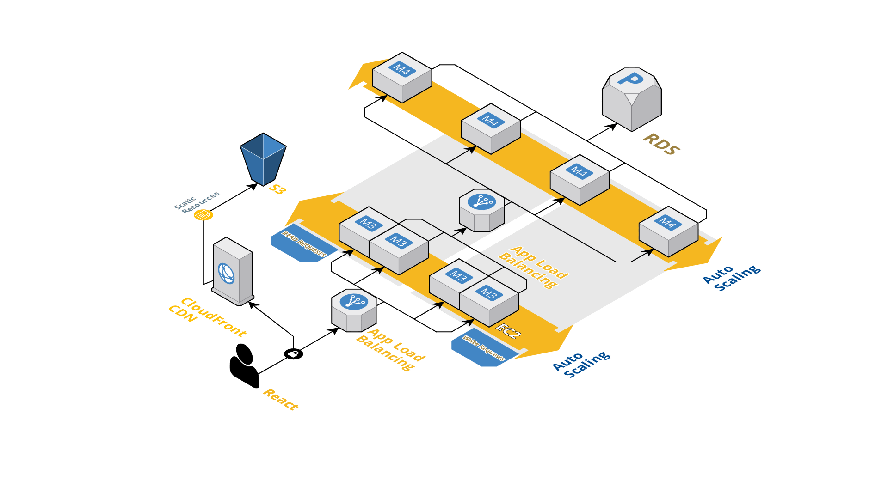

 sp20-cmpe-202-sec-03-team-project-wip
 sp20-cmpe-202-sec-03-team-project-wip created by GitHub Classroom
 
# Sprint Task Sheet
https://docs.google.com/spreadsheets/d/1bwUoeZ0_PFh3q6xMzNdLJCtQJ6lX0SsjbzNv-Miogr0/edit?usp=sharing

#Design Doc
https://docs.google.com/document/d/1DM46SGXyhCMIH70hC72ufU-x_5uT-EtUg1gDs10Lwmk/edit

# Project GoCar

# Team
1.Krutika
2.Sathya Sri
3.Sai Chaitanya Dasari
4.Yeswanth

# Tech Stack:
FrontEnd : React
Backend : Java Springboot with MySql
Cloud : AWS 

# Abstract

# Cloud Architecture
The application wii be designed using cloud native technologies, specifically AWS. The frontend will be served as a static website

 

# Backend Services
We will be using Java APIs to fetch the values from the SQL database. Since our application will render information on run-time, the non-blocking asynchronous nature of JAVA will help us get good performance.

# Data Layer
The data will be stored and accessed from a SQL database. SqlDb provides ACID properties structure which will assist in storing and querying structured data and handeling isolated transactions.

# Client Side
On the client side, we will make a ReactJS application. We are using ReactJS for the frontend as ReactJS is a light-weight library built over JavaScript, which doesn't re-render the entire DOM on change of components on the browser, rather it just re-renders the changed components. Hence ReactJS would improve application performance
